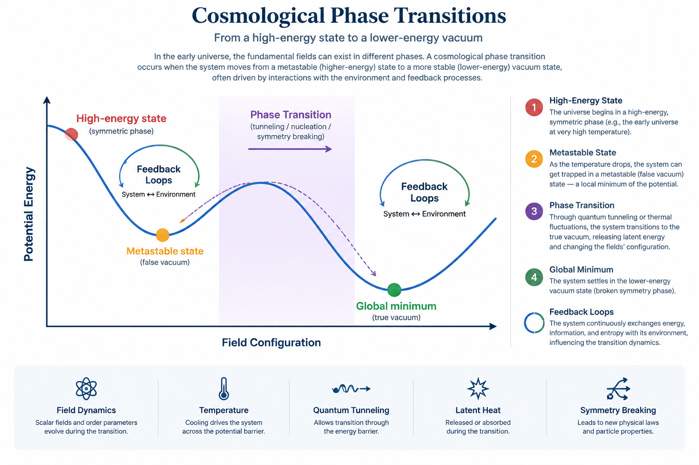

#  Pre-Friedmann Ground State & Stationary Extended Action

## 1. Motivation and Theoretical Context
In the standard cosmological paradigm, the cosmological constant problem and singular boundary conditions at $t \to 0$ require non-perturbative variational treatments. The **CRG-Flux** framework models the pre-Friedmann state not as a bare mathematical singularity, but as a dynamically stabilized, compact topological manifold governed by non-linear flexoelectric polarization and cavity-defect boundary closures.

*Figure 1 — Schematic of the stationary extended-action landscape: the reactive energy deficit at the singular edge is compensated by buffer-layer screening, yielding a bounded minimum instead of collapse. Schematic illustration (AI-rendered); no computed data.*

---

## 2. Stationary Extended Action Formulation
The pre-Friedmann ground state is obtained by demanding stationarity of the total effective extended action:
$$\delta S_{\rm eff} = \delta \left( S_{\rm bulk} + S_{\rm flexo} + S_{\rm buffer} + S_{\rm boundary} \right) = 0$$

Where each component is defined explicitly:

### A. Bulk Gravitational and Geometric Action
$$S_{\rm bulk} = \int_{\mathcal{M}} d^4x \sqrt{-g} \left( \frac{R - 2\Lambda_{\rm SDF}}{16\pi G} + \mathcal{L}_{\rm kinetic}(\dot{\Phi}) \right)$$

### B. Flexoelectric Coupling Action
$$S_{\rm flexo} = \int_{\mathcal{M}} d^4x \sqrt{-g} \left( \frac{1}{2} \mu_{ijkl} \left(\nabla^l \varepsilon^{jk}\right) \mathcal{P}^i - \frac{1}{2\chi_e} \mathcal{P}_i \mathcal{P}^i \right)$$

### C. Self-Regulating Buffer Dissipation Action
$$S_{\rm buffer} = \int_{\mathcal{M}} d^4x \sqrt{-g} \, \Theta_{\rm yield}\left(\frac{\sigma_y}{\kappa_c} - \Gamma_{\rm eff}(\dot{\Phi})\right) \left[ \frac{1}{2}\eta (\nabla_i v_j)^2 + \delta S_{\rm leak} \right]$$

### D. Topological Boundary and Defect Closure Term
$$S_{\rm boundary} = \oint_{\partial \mathcal{M}} d^3x \sqrt{-h} \left( \frac{K - K_0}{8\pi G} + \hat{C}_{\rm top} \mathcal{F}_{\rm cavity}[\Omega] \right)$$

The stationary condition $\delta S_{\rm eff} = 0$ guarantees that reactive energy deficits generated at singular geometric edges are dynamically balanced by the screening polarization of the buffer boundary layer.

---

## 3. Coupling to 2D Lattice Flexoelectricity
The topological curvature singularity in the cosmological metric maps directly to the apex of a sharp 2D flexoelectric wrinkle:
- The local Ricci curvature scalar $R$ maps to the extrinsic mean curvature $\kappa = \nabla^2 w$.
- The cosmological boundary flux matches the charge accumulation $\Delta Q \propto \nabla \kappa$ generated at strained atomic tips.

---

## 4. Connections & Related Nodes
- [[SDF Theory and Cavity Polarization]] — *Microscopic cavity states and edge-polarization genesis.*
- [[Quantum Flexoelectricity in Bent Graphene]] — *Strain gradient tensor coupling and polarization mechanics.*
- [[Tip Effect and Local Curvature Tensor]] — *Singularity sharpening and localized metric distortion.*
- [[Jacobian Stability and Attractor Proof]] — *Phase-space convergence of the pre-Friedmann ground state.*
- [[Three-Layered Dynamical Framework]] — *Macro-architectural integration of variational layers.*
- [[Extended Einstein-Dirac-Aether Dynamics]] — *Covariant vector-spinor kinetic anchors.*
