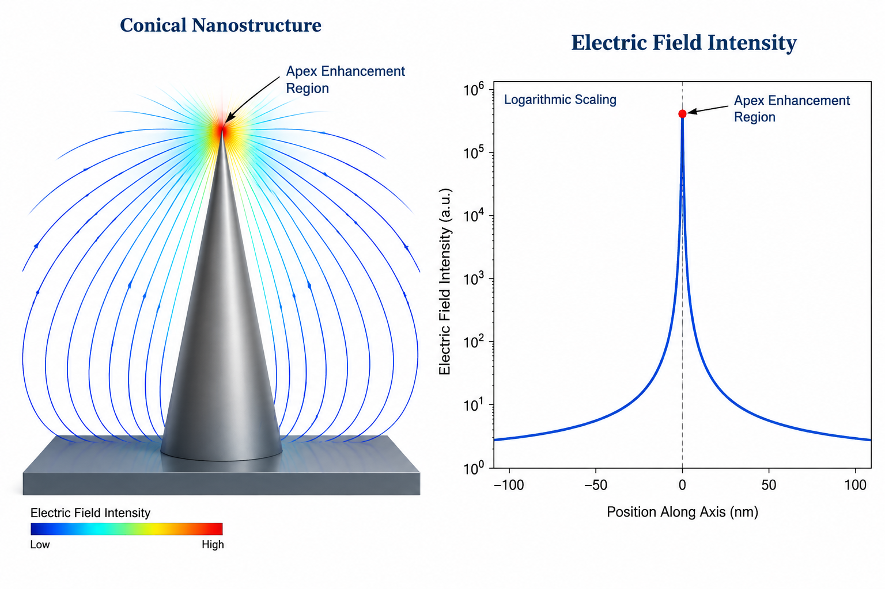

# Tip Effect and Local Curvature Tensor

> **Restoration note (E4, 2026-09-28):** this note's content had drifted into the
> file `06_Foundational_Literature/Extended Einstein-Dirac-Aether Dynamics.md`
> during an earlier editing pass; the true Einstein–Dirac–aether literature note
> was missing. Both files are now restored to their intended content.

## 1. Geometric Definition and Curvature Tensor Formulation

In nanostructured curved lattices (such as rippled graphene manifolds and localized edge-voids), geometric singularities develop at regions of extreme gradient deformation. Let the two-dimensional surface embedded in $\mathbb{R}^3$ be parameterized by Gaussian coordinates $u^\alpha = (u^1, u^2)$. The first and second fundamental forms are given by:

$$a_{\alpha\beta} = \partial_\alpha \mathbf{r} \cdot \partial_\beta \mathbf{r}, \quad b_{\alpha\beta} = \mathbf{n} \cdot \partial_\alpha \partial_\beta \mathbf{r}$$

where $\mathbf{n}$ is the unit surface normal. The local curvature tensor $\kappa_\beta^\alpha = a^{\alpha\gamma} b_{\gamma\beta}$ defines the invariant geometric measures:
- Mean Curvature: $H = \frac{1}{2} \operatorname{Tr}(\kappa) = \frac{1}{2} \kappa_\alpha^\alpha$
- Gaussian Curvature: $K = \det(\kappa) = \kappa_1^1 \kappa_2^2 - \kappa_2^1 \kappa_1^2$

Near a conical or parabolic tip extremity (curvature radius $R_{\rm tip} \to 0$), the principal curvature $\kappa_1 \sim 1/R_{\rm tip}$ diverges, generating a geometric singularity characterized by:

$$\lim_{r \to 0} \|\nabla \kappa(r)\| \propto r^{-(1+\delta)}, \quad \delta > 0$$

---

## 2. The Tip Effect: Electrostatic and Gradient Polarization

### 2.1 Lightning-Rod Amplification
Classical electrostatic field enhancement at a conductive or dielectric tip follows the lightning-rod singularity:

$$E(r) \approx E_0 \left(\frac{L}{R_{\rm tip}}\right)^{1 - \alpha_{\rm geom}} \left(\frac{R_{\rm tip}}{r}\right)^{\alpha_{\rm geom}}$$

where $L$ is the characteristic protrusion height and $\alpha_{\rm geom} \in (0, 1)$ depends on the opening apex angle.

### 2.2 Quantum Flexoelectric Coupling
In non-centrosymmetric elastic continua, the flexoelectric polarization $P_i$ couples directly to the strain gradients induced by the curvature tensor:

$$P_i = \mu_{ijkl} \frac{\partial \varepsilon_{jk}}{\partial x_l}$$

At the singular apex of the tip, the strain gradient tensor $\partial_l \varepsilon_{jk}$ scales linearly with $\partial_l \kappa_{jk}$. Consequently, the local polarization does not saturate at the linear continuum limit; rather, it produces an ultra-dense dipole accumulation:

$$\mathcal{P}_{\rm apex} \approx \mu_{\rm eff} \left( \frac{\kappa_{\rm max}}{a_0} \right) \mathbf{n}$$

where $a_0$ is the lattice constant and $\mu_{\rm eff}$ is the effective flexoelectric coefficient.

---

## 3. Threshold Dynamics: Departure from Linear Flexoelectricity

Standard linear flexoelectricity assumes an invariant elastic modulus tensor $C_{ijkl}$. However, when the curvature $\kappa$ approaches the critical geometric limit $\kappa_c$, the local stress tensor $\sigma_{ij} = C_{ijkl} \varepsilon_{kl}$ exceeds the local cohesive threshold:

$$\sigma_{\rm apex} \sim E_{\rm Young} \, h \, \kappa_{\rm max} \ge \sigma_y$$

This singular stress activates the threshold cutoff switch:

$$\Theta\left(\frac{\sigma_y}{\kappa_c} - \Gamma_{\rm eff}\right)$$

Below the threshold, the tip generates intense localized polarization traps (phase pinning). Above the threshold, the local tip enters the plastic relaxation regime, preventing infinite electrostatic divergence and feeding reactive energy directly into the second-tier transitory buffer shell.

---

## 4. Visual Evidence

*Figure 1 — Schematic of electric-field intensification toward the parabolic tip apex ($E \sim E_0 (L/R_{\rm tip})^{1-\alpha}$) with the yield-shell cutoff preventing divergence. Schematic illustration (AI-rendered); no computed data.*

---

## 5. Related Notes

- [[Pre-Friedmann Ground State & Action]] — Bulk variational boundary and closure conditions.
- [[Sharpness vs Amplitude Scaling]] — Experimental curvature-radius scaling relations.
- [[Yield Threshold]] — Mathematical formulation of the $\sigma_y / \kappa_c$ yield threshold.
- [[Effective Stiffness Reconstruction]] — Softening of elastic tensors under singular stress.
- [[Three-Layered Dynamical Framework]] — Role of tip localization in Tier-1 frozen-core screening.
