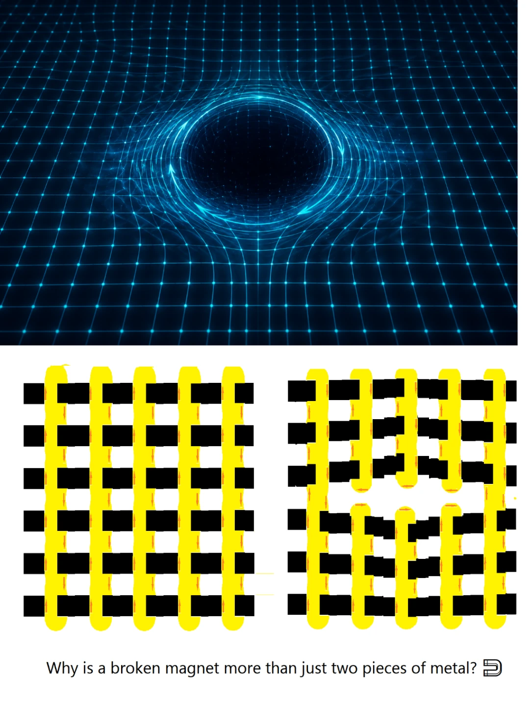

# B-Fracture Analogy & Dynamic Cohesion

## 1. The Broken Magnet Analogy at the Pre-Friedmann Boundary

When a macroscopic permanent magnet is cleaved across an internal boundary surface $\Sigma$, Gauss's law for magnetism ($\nabla \cdot \mathbf{B} = 0$) prevents the isolation of true magnetic monopoles. Instead, the sharp discontinuity in the remanent magnetization vector field:
$$\llbracket \mathbf{M} \rrbracket \equiv \mathbf{M}^+ - \mathbf{M}^-$$
induces equal and opposite fictitious magnetic surface charge densities:
$$\sigma_m = -\llbracket \mathbf{M} \rrbracket \cdot \hat{\mathbf{n}}$$
generating a strong demagnetizing return field across the cleavage gap.

*Figure 1 — Schematic of the broken-magnet analogy: $\nabla\!\cdot\!\mathbf{B}=0$ forbids isolated monopoles, so the cleavage gap develops equal-and-opposite fictitious pole sheets ($\sigma_m = -\llbracket\mathbf{M}\rrbracket\cdot\hat{\mathbf{n}}$) with a self-screening return field — the B-Fracture template. Illustrative composite (AI-rendered); no computed data.*

Within the **CRG-Flux framework**, the pre-Friedmann closure boundary behaves precisely as a self-healing flexoelectric fracture interface:
- The core order parameter field $\mathbf{\Psi}(\mathbf{r})$ undergoes steep spatial gradients at the closure boundary.
- Instead of collapsing into a divergent metric singularity, the topological discontinuity $\llbracket \mathbf{\Psi} \rrbracket$ excites a localized screening response within the surrounding buffer layer.
- The emergent interface charges neutralize the divergence, shifting the boundary from an unphysical singular cusp into a self-regulating, finite-cohesion dynamic interface.

---

## 2. Flexoelectric Jump and Effective Surface Charge

The microscopic origin of this screening is the strain-gradient-induced flexoelectric polarization within the puckered 2D carbon lattice:
$$P_i = \mu_{ijkl} \frac{\partial \varepsilon_{jk}}{\partial x_l} + \gamma_{ijk} \kappa_{jk}$$
where:
- $\mu_{ijkl}$ is the phenomenological flexoelectric tensor ($e_{\text{flexo}} \sim 0.1\text{--}1.0 \text{ nC/m}$).
- $\varepsilon_{jk}$ is the in-plane Cauchy strain tensor.
- $\kappa_{jk} \equiv \nabla_j \nabla_k w$ is the out-of-plane curvature tensor derived from corrugated displacements $w(\mathbf{r})$.
- $\gamma_{ijk}$ is the non-local topological coupling coefficient.

In the continuum limit, the spatial divergence of the order field defines an effective bulk topological charge density:
$$\rho_{\text{eff}} = -\nabla \cdot \mathbf{\Psi}$$

Across the singular yield front $\Gamma_{\text{fracture}}$ with 2D unit normal vector $\hat{\mathbf{n}}$ directed outward, distributional differentiation yields the exact jump condition:
$$\sigma_{\text{interface}} = -\llbracket \mathbf{\Psi} \rrbracket \cdot \hat{\mathbf{n}} = -(\mathbf{\Psi}^+ - \mathbf{\Psi}^-) \cdot \hat{\mathbf{n}}$$

This interface charge density preserves local topological dipole conservation across the 2D domain $\Omega$ bounded by 1D contour $\partial \Omega$:
$$\oint_{\partial \Omega} \sigma_{\text{interface}} \, dl + \int_{\Omega} \rho_{\text{eff}} \, d^2r = 0$$
guaranteeing that no uncompensated topological divergence escapes the pre-Friedmann closure envelope.

---

## 3. Cohesive Energy Functional and Elastic Reconstruction

The macroscopic stability of the boundary is governed by the coupled Ginzburg-Landau cohesive energy functional, separating mechanical membrane flexure, topological field gradients, and boundary fracture toughness:

$$\mathcal{F}_{\text{cohesion}}[\mathbf{\Psi}, w] = \int_{\Omega} \left[ \frac{1}{2} \alpha |\nabla \mathbf{\Psi}|^2 + V(\mathbf{\Psi}) + \frac{1}{2} K_{\text{eff}} (\nabla^2 w)^2 - \mathbf{P} \cdot \mathbf{E}_{\text{local}} \right] d^2r + \oint_{\partial \Omega} \Gamma_{\text{cohesive}} \, dl$$

### Dimensional and Constitutive Parameters:
1. **Effective Bending Stiffness ($K_{\text{eff}}$):**
   $$K_{\text{eff}} \equiv \kappa_b + \frac{\mu^2}{\chi_e \cdot t}$$
   - $\kappa_b \approx 1.2\text{--}1.5 \text{ eV} \approx (1.9\text{--}2.4) \times 10^{-19}\text{ J}$ is the bare flexural rigidity of monolayer graphene.
   - $\mu$ is the effective flexoelectric coupling coefficient ($[\text{C}\cdot\text{m}^{-1}]$ or $[\text{e}]$).
   - $\chi_e$ is the 2D dielectric susceptibility ($[\text{F}\cdot\text{m}^{-1}]$).
   - $t \approx 0.335 \text{ nm}$ is the nominal monolayer continuum thickness.
   - Dimension: $[K_{\text{eff}}] = \text{Joule (or eV)}$.
2. **Cohesive Fracture Toughness ($\Gamma_{\text{cohesive}}$):**
   $$\Gamma_{\text{cohesive}} = 2\gamma_{\text{surface}} - \Delta E_{\text{reconstruct}}$$
   - Dimension: $[\Gamma_{\text{cohesive}}] = \text{J}\cdot\text{m}^{-1}$ (Energy per unit length along the 1D fracture line).
   - Physical Mechanism: Balances classical Griffith cleavage energy against the relaxation energy gained through local $sp^2 \to sp^3$ rehybridization and bond reassignment.

---

## 4. Rate-Dependent Regime Switch and Dynamic Threshold

The transition from linear flexoelectric storage to dissipative buffer screening is governed by the **dynamic yield discriminant function** $\Theta_{\text{yield}}$:

$$\Theta_{\text{yield}} \equiv \frac{\sigma_y}{\kappa_c} - \Gamma_{\text{eff}}(\dot{\Phi})$$

where $\sigma_y / \kappa_c$ represents the intrinsic structural ratio of microscopic yield strength to singular tip curvature, and $\Gamma_{\text{eff}}(\dot{\Phi})$ is the rate-dependent dynamic dissipative capacity modulated by background scalar field velocity $\dot{\Phi}$:

| Regime | Mechanical & Field Condition | Microscopic Physical Response | Boundary Status |
| :--- | :--- | :--- | :--- |
| **I. Linear Flexoelectric** | $\Theta_{\text{yield}} > 0 \quad (\sigma < \sigma_y, \; \kappa < \kappa_c)$ | Pure elastic flexure; linear polarization $\mathbf{P} \propto \nabla \nabla w$; reversible dipole storage. | Intact continuum; lossless topological potential storage. |
| **II. Self-Regulating Yield** | $\Theta_{\text{yield}} \approx 0 \quad (\sigma \ge \sigma_y, \; \kappa \approx \kappa_c)$ | Kink-wall buckling; step jump $\llbracket \mathbf{\Psi} \rrbracket$ activates secondary buffer layer via dislocation nucleation. | Active dynamic cohesion; buffer shedding and screening. |
| **III. Topological Closure** | $\Theta_{\text{yield}} < 0 \quad (\kappa \to \kappa_{\text{sat}})$ | Saturation of dipole layers; leakage flux $J_{\text{leak}} \to 0$; topological soliton pinning. | Stable Pre-Friedmann compactification; frozen-core attractor locked. |

---

## 5. Architectural Links
- [[MOC - CRG-Flux Architecture]]
- [[Yield Threshold]]
- [[Tip Effect and Local Curvature Tensor]]
- [[Effective Stiffness Reconstruction]]
- [[Buffer Layer and Non-Equilibrium Transport]]
- [[Coupled Dynamical Equations]]
- [[Jacobian Stability and Attractor Proof]]
