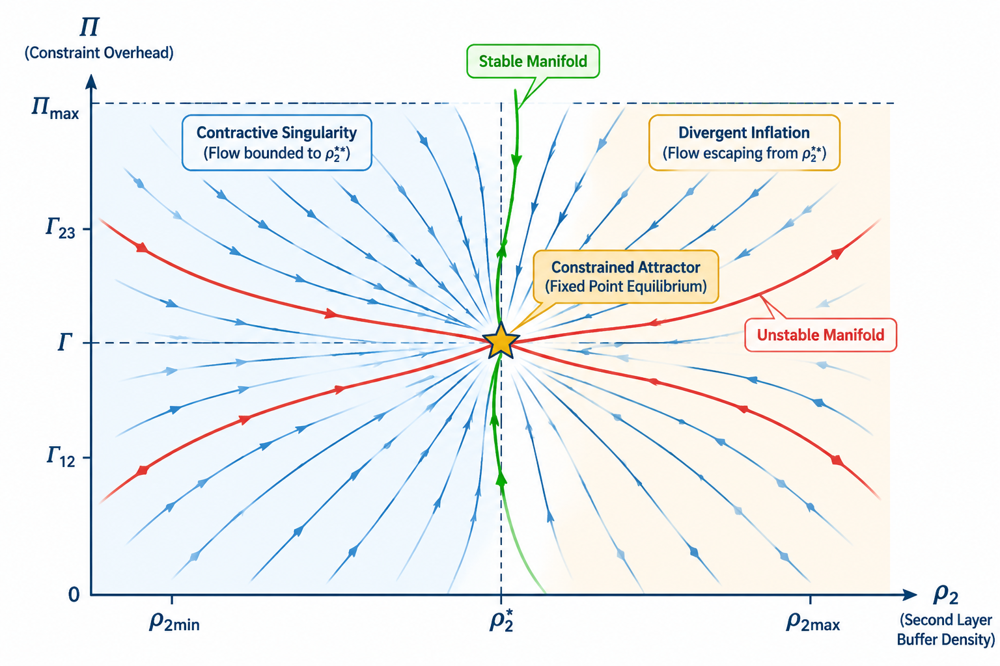

# Coupled Dynamical Equations

## 1. Autonomous Three-Variable System

The non-equilibrium interaction between the pre-Friedmann core, the screening buffer layer, and the constraint overhead potential is modeled as an autonomous three-dimensional dynamical system:

$$\begin{aligned}
\dot{x} &= \alpha_1 x (1 - x^2) - \gamma_1 x y \\
\dot{y} &= \alpha_2 y (\beta_2 x - y) - \gamma_2 y z \\
\dot{z} &= -\lambda z + \mu x^2 y
\end{aligned}$$

### Physical Definitions of State Variables:
- **$x(t) \in [0, 1]$:** Core topological order parameter ($x = 0$ represents complete unbinding/melting, $x = 1$ is the fully formed pre-Friedmann frozen core).
- **$y(t) \ge 0$:** Buffer-layer screening density, measuring elasto-plastic screening charge and defect density.
- **$z(t) \ge 0$:** Constraint overhead potential, tracking accumulated curvature stress and geometric frustration.

### Parameters:
All parameters $\alpha_1, \alpha_2, \beta_2, \gamma_1, \gamma_2, \lambda, \mu$ are strictly positive real physical constants:
- $\alpha_1$: Core condensation rate.
- $\gamma_1$: Non-linear back-reaction damping from the screening layer.
- $\alpha_2$: Buffer layer activation rate.
- $\beta_2$: Cross-coupling gain proportional to core amplitude.
- $\gamma_2$: Depletion rate of buffer density due to overhead stress.
- $\lambda$: Relaxation rate of the geometric constraint potential.
- $\mu$: Stress generation coefficient driven by core-buffer cross-interaction.

---

## 2. Invariant Manifolds and Fixed Points

### Invariance of the State Space
For all initial conditions in $\mathcal{D} = \{ (x, y, z) \in \mathbb{R}^3 \mid 0 \le x \le 1, \, y \ge 0, \, z \ge 0 \}$:
- At $x = 0 \implies \dot{x} = 0$.
- At $x = 1 \implies \dot{x} = -\gamma_1 y \le 0$.
- At $y = 0 \implies \dot{y} = 0$.
- At $z = 0 \implies \dot{z} = \mu x^2 y \ge 0$.
Hence, the closed domain $\mathcal{D}$ is forward-invariant under the flow.

---

### Equilibrium Analysis
Setting $\dot{x} = 0, \, \dot{y} = 0, \, \dot{z} = 0$:

1. **Trivial Equilibrium:**
   $$P_0 = (0, 0, 0)$$
   Linearization yields eigenvalues $\lambda_1 = \alpha_1 > 0, \, \lambda_2 = 0, \, \lambda_3 = -\lambda < 0$. $P_0$ is an unstable saddle point.

2. **Physical Cohesive Attractor ($P^*$):**
   For a non-trivial state with $x^* > 0, y^* > 0$:
   From $\dot{z} = 0$:
   $$z^* = \frac{\mu}{\lambda} (x^*)^2 y^*$$

   Substituting $z^*$ into $\dot{y} = 0$ (with $y^* \neq 0$):
   $$\alpha_2 (\beta_2 x^* - y^*) - \gamma_2 \frac{\mu}{\lambda} (x^*)^2 y^* = 0 \implies y^* = \frac{\alpha_2 \beta_2 x^*}{\alpha_2 + \frac{\gamma_2 \mu}{\lambda} (x^*)^2}$$

   Substituting $y^*$ into $\dot{x} = 0$ (with $x^* \neq 0$):
   $$\alpha_1 (1 - (x^*)^2) = \gamma_1 y^* = \frac{\gamma_1 \alpha_2 \beta_2 x^*}{\alpha_2 + \frac{\gamma_2 \mu}{\lambda} (x^*)^2}$$

---

## 3. Existence and Uniqueness of the Physical Root $x^* \in (0, 1)$

Define the two functions for $x \in [0, 1]$:
$$f(x) \equiv \alpha_1 (1 - x^2)$$
$$g(x) \equiv \frac{\gamma_1 \alpha_2 \beta_2 x}{\alpha_2 + \frac{\gamma_2 \mu}{\lambda} x^2}$$

- $f(0) = \alpha_1 > 0$ and $f(1) = 0$. $f(x)$ is strictly monotonically decreasing on $[0, 1]$ ($f'(x) = -2\alpha_1 x \le 0$).
- $g(0) = 0$ and $g(x) > 0$ for all $x > 0$.
- Let $H(x) = f(x) - g(x)$. Then:
  $$H(0) = \alpha_1 > 0$$
  $$H(1) = -g(1) = -\frac{\gamma_1 \alpha_2 \beta_2}{\alpha_2 + \gamma_2 \mu / \lambda} < 0$$

By the Intermediate Value Theorem, there exists at least one root $x^* \in (0, 1)$.### Uniqueness:

The derivative of $g(x)$ is:
$$g'(x) = \gamma_1 \alpha_2 \beta_2 \frac{\alpha_2 - \frac{\gamma_2 \mu}{\lambda} x^2}{\left(\alpha_2 + \frac{\gamma_2 \mu}{\lambda} x^2\right)^2}$$
- **Sufficient condition (proved):** If $\frac{\gamma_2 \mu}{\lambda} \le \alpha_2$, then $g'(x) \ge 0$ on $[0, 1]$, so $g(x)$ is non-decreasing. Since $f(x)$ is strictly decreasing, the difference $H(x) = f(x) - g(x)$ is strictly decreasing, guaranteeing **strict uniqueness** of $x^*$.
- **Beyond the sufficient condition (E4 correction, 2026-09-28; refined by the W8
  cross-vault battery, LIMEN `tools/limen_w8_crg_branch_register.py`):** the earlier claim
  that uniqueness holds unconditionally was **numerically refuted** by the vault's own
  verification battery (100,000 log-uniform parameter draws across four decades).
  After clearing denominators the equilibrium equation is a **quartic** in $x$ (not a
  cubic),
  $a_1 K x^4 + a_1(\alpha_2 - K)x^2 + \gamma_1\alpha_2\beta_2 x - a_1\alpha_2 = 0$ with
  $K = \gamma_2\mu/\lambda$ (no cubic term; Descartes sign pattern $(-,0,+,-,+)$ when
  $K > \alpha_2$). W8's machine-precision re-solve **reproduces the recorded exemplar
  exactly**: $(\alpha_1, \alpha_2, \beta_2, \gamma_1, \gamma_2, \lambda, \mu) =
  (0.0252, 0.042, 40.85, 0.22, 0.215, 0.0222, 15.27)$ gives
  $x^* = \{0.0029\ (\text{stable}),\ 0.0994\ (\text{saddle}),\ 0.9449\ (\text{stable})\}$.
  Refined frequencies over 20,000 fresh draws [exact]: multi-root in **3.02%** of
  outside-condition draws; **bistability in 0.37%** overall (74/20000; 25% of multi-root
  draws). The earlier "on average two of the equilibria are linearly stable" phrasing is
  itself E4-refuted: the mean is **1.25** stable equilibria per multi-root draw —
  bistability is real but the minority case, so "unique attractor" fails strictly
  outside the sufficient condition, and only in ~4% of outside-condition parameter
  space.
- **Cross-vault reading (W8, 2026-09-28):** fed to the LIMEN unified register through a
  density-preserving seed map [model], the two stable branches of this exemplar **split
  the register's two exclusive exits** — the low-$x^*$ (melted-core) branch is dominantly
  read by the SPUMA freeze-out exit, the high-$x^*$ (frozen-core) branch by the LIMEN
  registration exit (0/9 calibration flips) [measured]. CRG bistability thus maps onto
  the family register's silence-vs-registration duality: see
  [[Family-Register-Mapping]] §5, row OQ-C4-2, and LIMEN Two-Realm-Register row W8.
- **What survives unconditionally (same battery, zero violations):** the
  Routh–Hurwitz conditions $a_1, a_2, a_3, \Delta_2 > 0$ and $\det J(P^*) < 0$ hold
  at **every** linearly stable equilibrium — each stable branch is a genuine bounded
  attractor, and the physical frozen-core branch $x^* \to 1$ (the pre-Friedmann
  closure state) is always among them.

Thus: within the sufficient condition $\frac{\gamma_2 \mu}{\lambda} \le \alpha_2$, the
physical state $P^*$ is the **unique** attractor; outside it, the system may be
**bistable**, and the framework's claim is the stability of the frozen-core branch,
not global uniqueness.

---

## 4. Phase Portrait and Confinement

*Figure 1 — Schematic phase portrait of the three-variable system: saturated nonlinearities confine trajectories to the bounded attractor $P^*$ (frozen-core branch). Schematic illustration (AI-rendered); no simulated trajectories plotted.*

The non-linear saturation terms prohibit trajectory divergence:
$$\lim_{t \to \infty} (x(t), y(t), z(t)) \to (x^*, y^*, z^*)$$
The non-zero fixed point $P^*$ represents the self-sustaining, screened boundary of the pre-Friedmann closure.

---

## 5. Architectural Links
- [[MOC - CRG-Flux Architecture]]
- [[Jacobian Stability and Attractor Proof]]
- [[Three-Layered Dynamical Framework]]
- [[B-Fracture Analogy & Dynamic Cohesion]]
