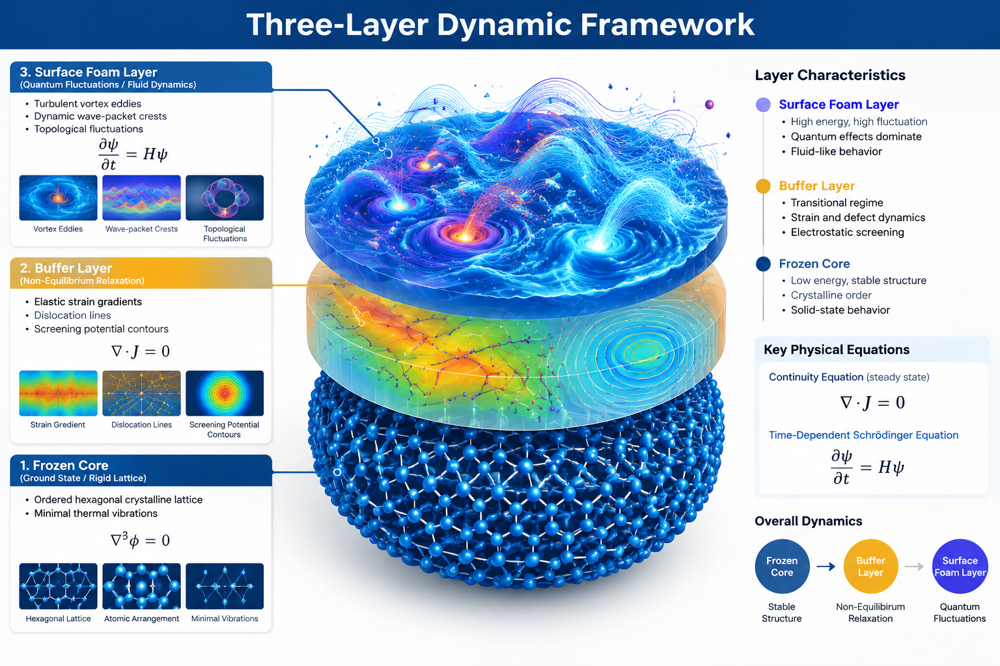

#  Three-Layered Dynamical Framework

## 1. Multi-Tier Variational Architecture
The **CRG-Flux** architecture resolves the multi-scale stability paradox through a hierarchically coupled three-tier structure:

```mermaid
graph TD
subgraph Tier1 [Tier 1: High-Curvature Core]
A[Geometric Apex / Void Boundary] -->|Extreme Curvature kappa_local| B[Flexoelectric Polarization P_flexo]
B -->|Singular Stiffening| C[Hard-Core Elastic Sheath D_eff]
end

subgraph Tier2 [Tier 2: Self-Regulating Buffer Shell]
D[Yield Switch Theta_yield] -->|sigma >= sigma_y| E[Plastic Shear Relaxation]
E -->|Berry Phase Gapping Phi=pi| F[Dissipative Phase-Leak Suppression]
end

subgraph Tier3 [Tier 3: Asymptotic Far-Field Horizon]
G[Macro Metric / Substrate] -->|Stationary Closure| H[Pre-Friedmann Action delta S = 0]
H -->|Attractor Flow| I[Stable Cosmological State]
end

Tier1 -->|Diverted Excess Strain| Tier2
Tier2 -->|Screened Boundary Flux| Tier3
Tier3 -.->|Global Boundary Feedback| Tier1

style Tier1 fill:#2b1a29,stroke:#e06c75,stroke-width:2px;
style Tier2 fill:#1a2634,stroke:#61afef,stroke-width:2px;
style Tier3 fill:#1e2d24,stroke:#98c379,stroke-width:2px;
```

*Figure 1 — The three-tier CRG-Flux architecture as a static schematic (AI-rendered): Tier-1 high-curvature core (singular stiffening), Tier-2 self-regulating buffer shell (yield switch + dissipative phase-leak suppression), Tier-3 asymptotic far-field horizon (stationary closure). The mermaid graph above is the formal, canonical rendering; this image is a decorative companion. Same figure is cross-linked from the MOC.*