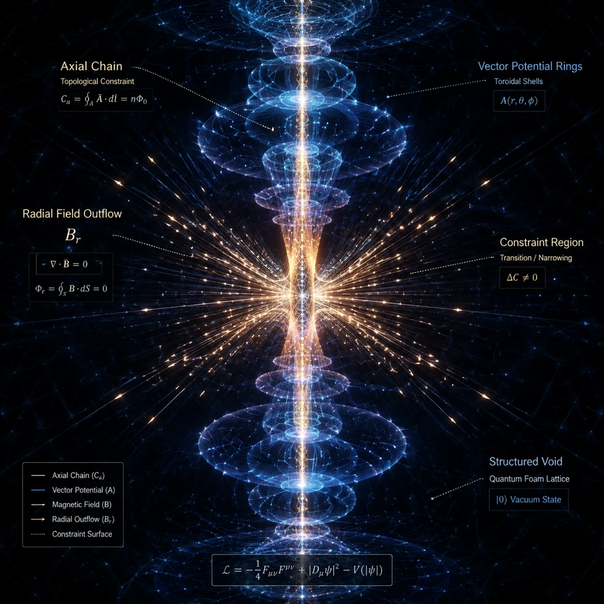

# KPZ Growth and Surface Fluctuations

## 1. Mathematical Formulation of the KPZ Universality Class

The macroscopic surface dynamics governing non-equilibrium interface propagation is modeled by the stochastic non-linear partial differential equation introduced by Kardar, Parisi, and Zhang (KPZ):

$$\frac{\partial h(\mathbf{x}, t)}{\partial t} = \nu \nabla^2 h + \frac{\lambda}{2} (\nabla h)^2 + \eta(\mathbf{x}, t)$$

> **Primary source (E4, 2026-09-28):** the local asset `Assets/conf239-1.pdf` was
> identified by its embedded metadata as **Kazumasa A. Takeuchi, "Introduction to
> the KPZ equation and its experimental aspects" (Lecture notes, Les Houches School
> on KPZ, ver. 3, 74 pp., Univ. Tokyo)** — the pedagogical/experimental anchor for
> this note. Filename `conf239-1.pdf` carries no semantic information (conference-
> management download name); the SHA-256 fingerprint is registered in the
> Figure-and-Asset Register so provenance survives any future rename.

where:
- $h(\mathbf{x}, t)$ represents the continuous height profile of the dynamic boundary along the substrate coordinate $\mathbf{x} \in \mathbb{R}^d$ at time $t$.
- $\nu$ is the effective surface tension or smoothing parameter tending to minimize interfacial area.
- $\lambda$ characterizes the non-linear growth velocity projecting along the local normal vector $\hat{\mathbf{n}}$, proportional to the squared lateral gradient $(\nabla h)^2$.
- $\eta(\mathbf{x}, t)$ denotes uncorrelated Gaussian white noise satisfying:

$$\langle \eta(\mathbf{x}, t) \rangle = 0, \quad \langle \eta(\mathbf{x}, t) \eta(\mathbf{x}', t') \rangle = 2 D \delta^d(\mathbf{x} - \mathbf{x}') \delta(t - t')$$

with noise amplitude $D$.

### 1.1 Scaling Laws and Exponents

The interfacial roughness width $W(L, t)$ over a characteristic length scale $L$ exhibits Family-Vicsek dynamic scaling:

$$W(L, t) = \left\langle \frac{1}{L^d} \int [h(\mathbf{x}, t) - \bar{h}(t)]^2 d^d x \right\rangle^{1/2} \sim L^\alpha f\left(\frac{t}{L^z}\right)$$

where:
- $\alpha$ is the static roughness exponent.
- $z$ is the dynamic scaling exponent ($z = \alpha / \beta$).
- $\beta$ is the early-time growth exponent ($W \sim t^\beta$ for $t \ll L^z$).

In one spatial dimension ($d = 1+1$), Galilean invariance and fluctuation-dissipation constraints fix the exact exponents to:

$$\alpha = \frac{1}{2}, \quad \beta = \frac{1}{3}, \quad z = \frac{3}{2}$$

satisfying the invariant scaling relation $\alpha + z = 2$.

---

## 2. Integration into the Three-Tier Variational Closure

Within the CRG-Flux architecture, the KPZ equation dictates the kinetic evolution of the Tier-3 macro-boundary interface interacting with the underlying Tier-2 non-equilibrium transitory buffer layer.

### 2.1 Non-Linear Growth and Flexoelectric Stress Coupling

The kinetic parameter $\lambda$ originates from the directional flux generated by localized flexoelectric polarization gradients. In curved graphene-like geometries, the polarization tensor $P_i = \mu_{ijkl} \partial_l u_{jk}$ couples directly to curvature gradients:

$$\lambda_{\rm eff} \sim \gamma_0 \left( \frac{\partial \sigma_{ij}}{\partial x_k} \right) \hat{n}_k$$

As local voids aggregate along boundary edges, the non-linear lateral term $\frac{\lambda}{2}(\nabla h)^2$ accounts for the rapid lateral migration and coalescence of void boundaries under pre-stress.

### 2.2 Curvature Singularities and the Yield Threshold Cutoff

In classical unconstrained KPZ systems, interfacial roughness scales monotonically until boundary saturation. In the Pre-Friedmann closure framework, however, divergent height gradients ($\nabla h \to \infty$) correspond to microscopic tip formations with singular local curvatures:

$$\kappa \approx \frac{|\nabla^2 h|}{(1 + |\nabla h|^2)^{3/2}}$$

When local curvature $\kappa$ approaches the critical threshold $\kappa_c$, the induced flexoelectric stress exceeds the material yield stress $\sigma_y$. This triggers a dynamic regime shift governed by the Heaviside activation:

$$\Theta\left( \frac{\sigma_y}{\kappa_c} - \Gamma_{\rm eff} \right)$$

This threshold terminates unphysical scale-free roughness blow-up by activating plastic dissipation within the self-regulating buffer shell, screening the macro-boundary from kinetic divergences.

---

## 3. Structural Analogy: B-Fracture and Magnetostatics

The fluctuating profile $h(\mathbf{x}, t)$ maps topologically to the propagation front of a tensile fracture in a permanent magnet. At the fracture lips:
- Discontinuous surface magnetization creates effective magnetic surface charge densities $\sigma_M = \mathbf{M} \cdot \hat{\mathbf{n}}$.
- Surface roughness fluctuations modulate the local dipolar demagnetizing fields.
- The KPZ smoothing term $\nu \nabla^2 h$ acts in direct equivalence to the magnetic domain-wall cohesive energy, penalizing sharp jagged boundaries and stabilizing the interface into a coherent phase-space attractor.

---

## 4. Visual Evidence

*Figure 1 — Schematic of polarization structuring at void boundaries, echoing non-equilibrium surface-charge localization (KPZ front ↔ fracture-lip mapping). Shared illustration; AI-rendered schematic, no computed data.*

---

## 5. Related Notes

- [[01_Core_SDF_and_Closure/Pre-Friedmann Ground State & Action]] — Variational boundary action and closure constraints.
- [[02_Experimental_Flexoelectricity/Sharpness vs Amplitude Scaling]] — Non-linear curvature scaling relations.
- [[03_Geometric_Singularity_Tip/Tip Effect and Local Curvature Tensor]] — Local tensor curvature singularities.
- [[03_Geometric_Singularity_Tip/Yield Threshold]] — Mathematical formulation of the $\sigma_y / \kappa_c$ switching cutoff.
- [[04_Buffer_and_B_Fracture/B-Fracture Analogy & Dynamic Cohesion]] — Crack boundary conditions and topological dipole creation.
- [[05_Phase_Space_Attractor/Three-Layered Dynamical Framework]] — Attractor stabilization across Tier 1, Tier 2, and Tier 3.
