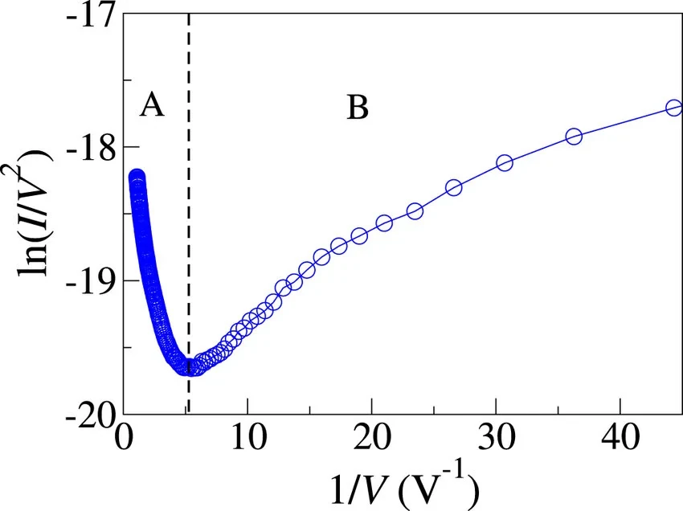

# Mesoscopic Transport and Green Functions

> **Citation completion (E4, 2026-09-28):** the two asset PDFs are now identified.
> `9902307v1.pdf` = **arXiv:cond-mat/9902307** — Baigeng Wang, Jian Wang & Hong Guo,
> "Nonlinear I-V Characteristics of a Mesoscopic Conductor" (the bare ID "9902307"
> does not resolve on arXiv; the archive prefix is required).
> `1912.02126v2.pdf` = **arXiv:1912.02126** — Maria Patmiou & V. G. Karpov,
> "Qualitative methods in condensed matter physics" (pedagogical source for the
> intuition-based pattern-recognition approach used across this vault).

## 1. Non-Equilibrium Green's Function (NEGF) Transport
Charge carrier transport and field emission characteristics across singular nanostructures are evaluated using the Landauer-Büttiker and NEGF formalism:

$$G^r(E) = \left[ (E + i\eta) I - H_{\text{device}} - \Sigma_L(E) - \Sigma_R(E) \right]^{-1}$$

The transmission function $T(E)$ is determined by:

$$T(E) = \operatorname{Tr} \left[ \Gamma_L(E) G^r(E) \Gamma_R(E) G^a(E) \right]$$

*Figure 1 — Schematic I–V curve of a mesoscopic conductor with the Fowler–Nordheim-type bending used for tip-field diagnostics. Schematic illustration (AI-rendered); not a reproduction of the Wang–Wang–Guo numerical results.*

## 2. Foundational Research References
- **Primary Sources:** `[[Assets/9902307v1.pdf]]` and `[[Assets/1912.02126v2.pdf]]`
- **Fowler-Nordheim Scaling:** In the high-bias limit, $\ln(I/V^2)$ vs $1/V$ exhibits the characteristic linear-to-non-linear transition observed in tip field enhancement.

## 3. Related Notes
- [[Quantum Flexoelectricity in Bent Graphene]]
- [[Tip Effect and Local Curvature Tensor]]
- [[Buffer Layer and Non-Equilibrium Transport]]
